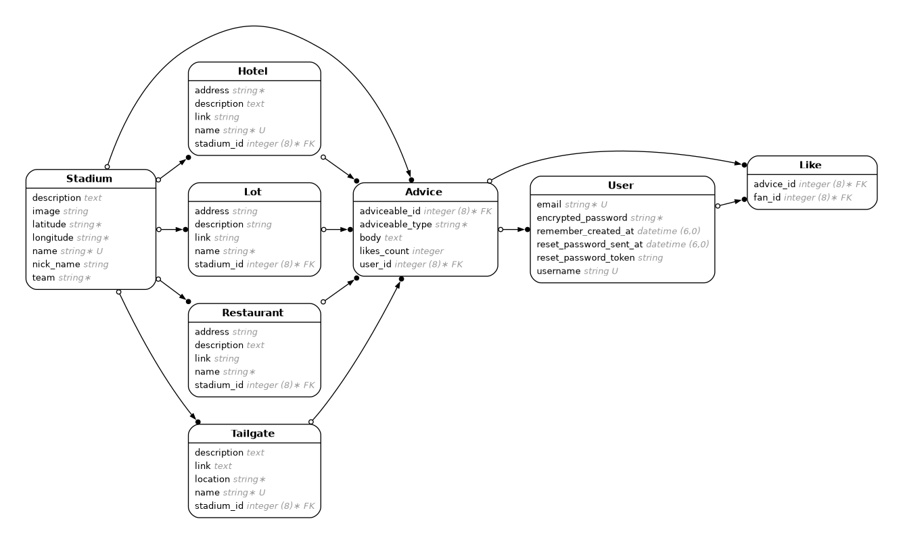

# Tailgators
- Ruby version: `3.2.1`
- Rails version: `7.1.3.3`

## Description
- This is a web app built in Rails about travelling to a new stadium.  When travelling to a new stadium for sporting events, there is a lot of information travellers would like to know about such as parking, hotels, restaurants, transportation, and tailgating.

## Github Project
- [Link](https://github.com/dylansarikas/tailgators)

## Table of Contents
- [Installation](#installation)
- [Usage](#usage)
- [Configuration](#configuration)
- [ERD](#erd)

## Installation

1. Clone the repository:
`git clone https://github.com/dylansarikas/tailgators`

2. Navigate to the project directory:
`cd yourproject`

3. Install the required gems:
`bundle install`

4. Set up the database:
`rails db:setup`

5. Start the Rails server:
`bin/dev`

## Usage

1. Start the Rails server:
`bin/dev`

2. Open your browser and navigate to http://localhost:3000
Follow the on-screen instructions to use the application

3. You can use the sign in of "tester@example.com" with the password of "password" to sign in

## Configuration

1. A Google Maps API key for Static Images must be set up so the images are displayed correctly.  

2. The key can be stored in credentials.yml along with a master key.  

3. The API key can be accessed with Rails.application.credentials.google_maps_key after it is set up with rails credentials.

## ERD

